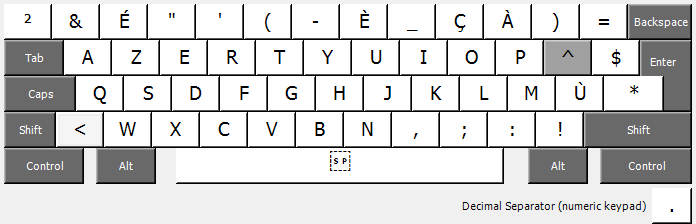
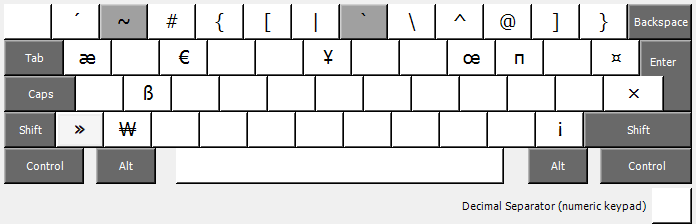
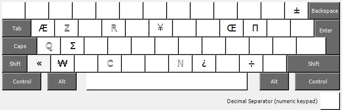

Azerty+
=======

En ayant eu assez de galérer pour taper certaines lettres du français sous Windows, je me suis attelé
à la modification du pilote (driver) de clavier. J'ai pour cela utilisé [Microsoft Keyboard Layout Creator (MSKLC)](https://www.microsoft.com/en-us/download/details.aspx?id=102134).
Le résultat est à libre disposition sous license [Unlicense](https://unlicense.org) (c.-à-d. domaine public).

Différences par rapport à un clavier AZERTY classique
=====================================================

Ver. Maj.
---------

C'est la principale différence: la touche _Ver. Maj._ (ou _CapsLock_) agit **vraiment** comme une touche
_CapsLock_ et non comme une touche _ShiftLock_. Cela signifie qu'appuyer sur `é` tandis que _Ver. Maj._
est actif, donnera `É` et non `2`. Il en va de même pour toutes les autres touches (celles n'ayant pas
d'équivalent majuscule restent simplement telles quelles).

_Ver. Maj._: 

_Shift_: 

_Ver. Maj._ + _Shift_: 

Alt. Gr.
--------

Les combinaisons permises par la touche _Alt Gr_ ont été enrichies pour permettre de taper certains symboles manquants:

| Combinaison             | Résultat                                                   |
|:------------------------|:-----------------------------------------------------------|
| _AltGr_ +           `A` | `æ` (ligature AE minuscule) |
| _AltGr_ + _Shift_ + `A` | `Æ` (ligature AE majuscule) |
| _AltGr_ + _Shift_ + `C` | `ℂ` (C majuscule ajouré ou ensemble des nombres complexes) |
| _AltGr_ + _Shift_ + `N` | `ℕ` (N majuscule ajouré ou ensemble des entiers naturels)  |
| _AltGr_ +           `O` | `œ` (ligature OE minuscule) |
| _AltGr_ + _Shift_ + `O` | `Œ` (ligature OE majuscule) |
| _AltGr_ +           `P` | `π` (pi minuscule)                                         |
| _AltGr_ + _Shift_ + `P` | `Π` (pi majuscule)                                         |
| _AltGr_ + _Shift_ + `Q` | `ℚ` (Q majuscule ajouré ou ensemble des nombres rationels) |
| _AltGr_ + _Shift_ + `R` | `ℝ` (R majuscule ajouré ou ensemble des nombres réels)     |
| _AltGr_ +           `S` | `ß` (eszett)                                               |
| _AltGr_ + _Shift_ + `S` | `Σ` (sigma majuscule)                                      |
| _AltGr_ +           `W` | `₩` (Won)                                                  |
| _AltGr_ + _Shift_ + `W` | `￦` (Won pleine largeur)                                  |
| _AltGr_ +           `Y` | `¥` (Yen)                                                  |
| _AltGr_ + _Shift_ + `Y` | `￥` (Yen pleine largeur)                                  |
| _AltGr_ + _Shift_ + `Z` | `ℤ` (Z majuscule ajouré ou ensemble des entiers relatifs)  |
| _AltGr_ +           `1` | `´` (accent aigu)                                          |
| _AltGr_ +           `*` | `×` (multiplication)                                       |
| _AltGr_ +           `+` | `±` (plus ou moins)                                        |
| _AltGr_ +           `<` | `«` (guillemet ouvrant)                                    |
| _AltGr_ + _Shift_ + `<` | `»` (guillemet fermant)                                    |
| _AltGr_ + _Shift_ + `,` | `¿` (point d'interrogation culbuté)                        |
| _AltGr_ +           `:` | `÷` (division)                                             |
| _AltGr_ +           `!` | `¡` (point d'exclamation culbuté)                          |
| _AltGr_ +           `␠` | ` ` (espace insécable)                                     |
| _AltGr_ + _Shift_ + `␠` | ` ` (espace tabulaire ou espace nombre)                    |

_Alt. Gr._: 

_Alt. Gr._ + _Shift_: 

